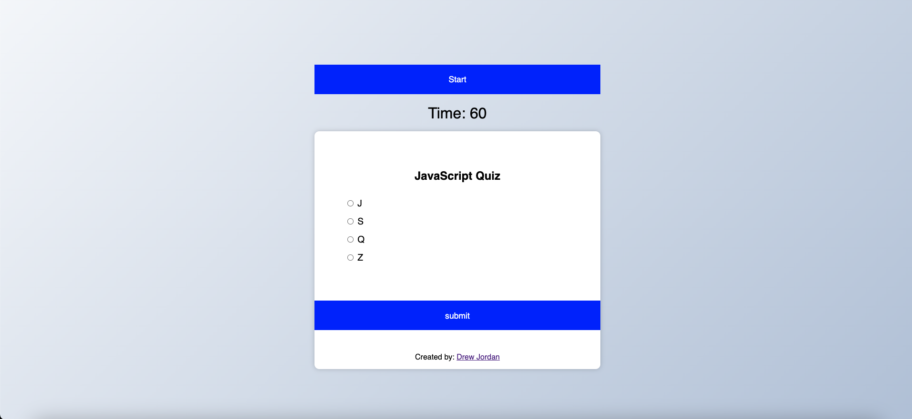
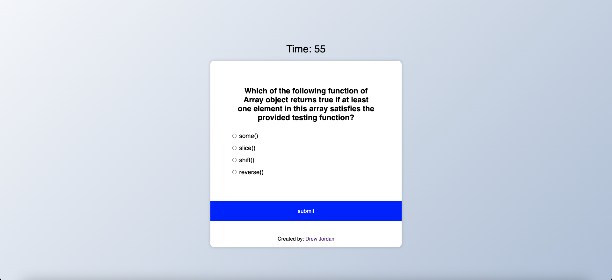

# code-quiz

## Criteria

```
GIVEN I am taking a code quiz
WHEN I click the start button
THEN a timer starts and I am presented with a question
WHEN I answer a question
THEN I am presented with another question
WHEN I answer a question incorrectly
THEN time is subtracted from the clock
WHEN all questions are answered or the timer reaches 0
THEN the game is over
WHEN the game is over
THEN I can save my initials and score
```
## Features
- The quiz is timed and the user is given 60 seconds to complete the quiz.
- The user is presented with a question and four possible answers.
- If the user selects the correct answer, they are presented with another question.
- If the user selects the wrong answer, 10 seconds are subtracted from the timer.
- If the timer reaches 0, the game is over.
- When the game is over, the user can save their initials and score.
- The user can view their high score at any time.
- The user can clear their high score at any time.

## Description
- For the questions, I used an array of objects. Each object has a question, an array of answers, and the index of the correct answer.
- The timer is set to 60 seconds. Each wrong answer subtracts 10 seconds from the timer.

## Borrowed Code
1. Reset CSS
    - https://github.com/elad2412/the-new-css-reset/tree/main
2. Inspiration and the framework
    -  https://www.youtube.com/watch?v=CqddbIrEM5I
        - This video was a great help in getting started. I used the video as a starting point to help visualize the project as well as better undertsand the relationship between the array and objects created inside the array.
        1. quizData array setup
        2. loadQuiz()
        3. getSelected()
        4. deselectAnswers()
        5. submitBtn.addEventListener('click', () => {})
    

## Deployed Application
https://drewjordan414.github.io/code-quiz/


## Screenshots




